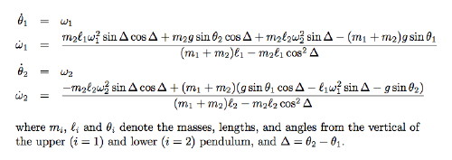
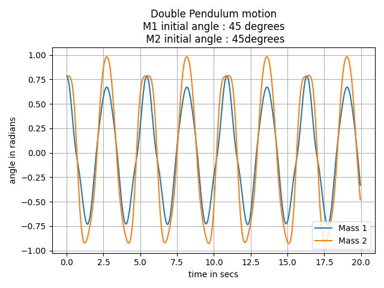
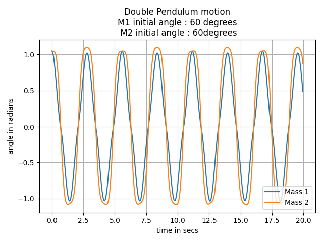
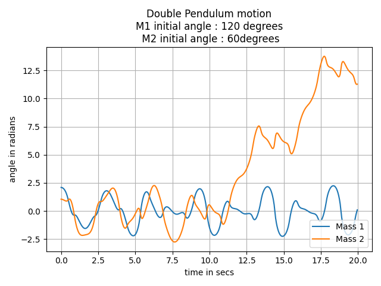

# DoublePendulum

Description :Compares the motion of first mass against second mass in a double pendulum using Lagrange's equation of motion.

Usage: Enter parameters for initial angles for mass 1 and mass 2 to get the motion for both masses at different time steps.

Lagrange's equation of motion used: 

Graphs examples:

